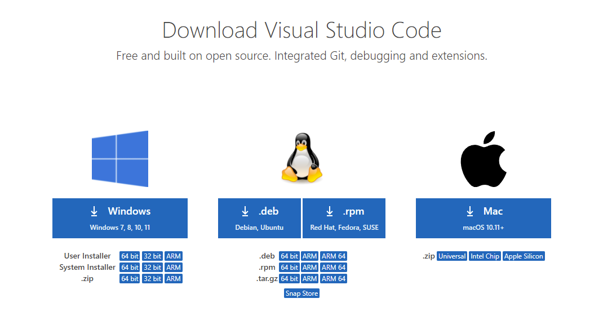

# Lab Report 1

***

## Installing VScode

1. Go to [this link](https://code.visualstudio.com/download) and the image below should appear.
2. Click on the appropritae version for your operating system, and follow the instructions as given.



## Remotely Connecting to SSH

1. Make sure to install OpenSSH on your system. For Windows, go to Settings>Apps>Apps & Feautures>Optional Features and make sure that OpenSSH Client and OpenSSH server is installed.
2. Find your course specific log in info at [this link](https://sdacs.ucsd.edu/~icc/index.php)
3. Open a terminal is VSCode and type `ssh cs15lwi22zz@ieng6.ucsd.edu`, where zz is the letters for your specific account, and then type your password.
4. The output should look similar to the image below.


## Trying Some Commands

1. There's a multitude of commands that can be run on both your client terminal and the SSH terminal.
2. Some of them include `cd`, `lws`, `pwd`, `cp`, and `mkdir`.
3. The example below shows the command `cd f` being run, but there is no file system called `f` on the server, so it is not able to run.


## Moving Files with `scp`

* Create a java file. I created a java file called `WhereAmI.java` with the following code:

```
class WhereAmI {
  public static void main(String[] args) {
    System.out.println(System.getProperty("os.name"));
    System.out.println(System.getProperty("user.name"));
    System.out.println(System.getProperty("user.home"));
    System.out.println(System.getProperty("user.dir"));
  }
}
```

1. Use the command `scp WhereAmI.java cs15lwi22zz@ieng6.ucsd.edu:~/` and type in your password to add it to the server.
2. Then, log back in to the server to check if the file got added by using the command `ls`. The output should look like this:


## Setting an SSH Key

1. For Windows, use [this link](https://docs.microsoft.com/en-us/windows-server/administration/openssh/openssh_keymanagement#user-key-generation) to create an ssh key on your computer.
2. Use `mkdir` on your server to create a directory called `.ssh`.
3. Use `scp` to add the key from the folder you generated to `cs15lwi22zz@ieng6.ucsd.edu:~/.ssh/authorized_keys`
4. Notice, that whenever you want to log into the server on the computer you did this on, it will look like the image below. You won't have to type in the password anymore.


## Optimizing Remote Running

1. Writing commands a lot of times can get annoying and there are many ways to make it faster.
2. If you use your up arrow, you can reuse previous commands you entered.
3. It is also possible to use many commands at once, as shown in the screenshot below.
4. Make sure to use these strategies to your advantage.

