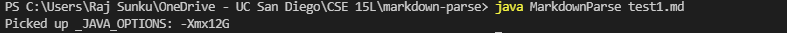
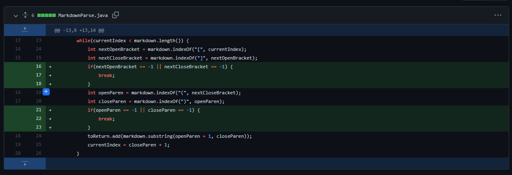
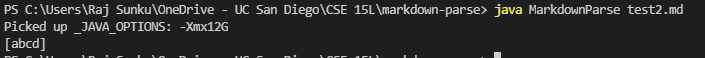
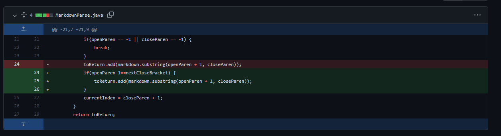
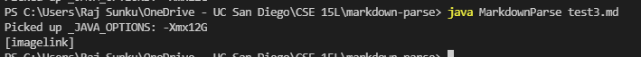
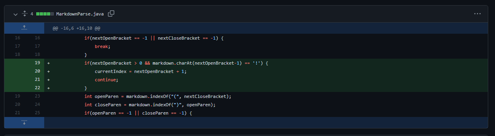

# Lab Report 2

***

## MarkdownParse Issue 1

[Test File](https://github.com/rajsunku/markdown-parse/blob/main/test1.md)

Invalid Output:

From the output above, the test file causes an infinite loop, which means that there was no empty array that was printed out. The bug in the code that caused this symptom was that if there wasn't a closing parenthesis after an open one (which was the failure inducing input), the indexOf command would return -1, thus resetting currentIndex to 0 and kept the loop going forever. To fix this, lines were added as shown below to stop the loop in there isn't either bracket or parentheses since there will be no more links if one is missing.

## MarkdownParse Issue 2

[Test File](https://github.com/rajsunku/markdown-parse/blob/main/test2.md)

Invalid Output:

The symptom shown here shows that non-links get added to the list. In the input, there was a set of brackets and then text in a parenthesis much after the brackets. This means that they aren't considered links, and showuld have been outputted in the list. The bug in the code that caused this was that we had to check to make sure that the close bracket was next to the open parenthesis, because otherwise it would not be considered a link.

## MarkdownParse Issue 3

[Test File](https://github.com/rajsunku/markdown-parse/blob/main/test3.md)

Invalid Output:

The failure inducing input was an image link in the markdown file. This caused the symptom of the image link being added to the list even though we only want regular links to be added. The bug in the code that caused this was that we didn't check if there was a '!' before the open bracket, so it was fixed as shown under.

