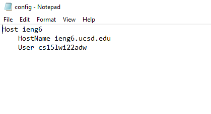
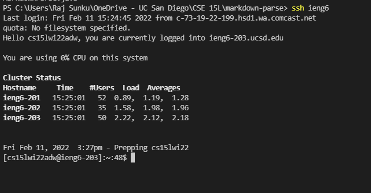

# Lab Report 3: Streamlining SSH Configuration

***

## Editing .ssh/config

In my .ssh/config file on my personal computer, I added the following lines to it using the notepad app. This allows me to say `ssh ieng6` instead of remembering the whole email to log into the ssh server.

## Using ssh

As you can see in the image below, the comman I entered in the terminal was `ssh ieng6`. It made it a lot easier for me to log into the server and was a lot less characters to type. In the screenshot below, it also shows that it logged into my particular account.

## Using scp

From the image below, it is also possible to use the alias to add files to the ssh server. The output from the command shows that `MarkdownParse.java` was added successfully to the ssh server and there were no errors that occured even with the much shorter command.

