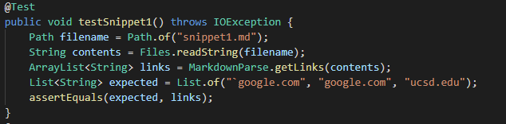
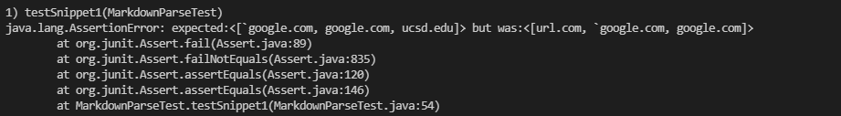
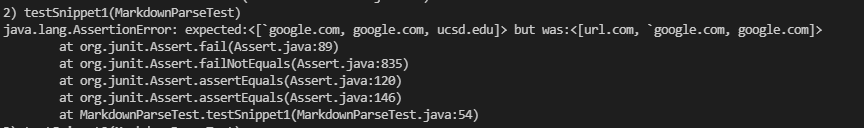
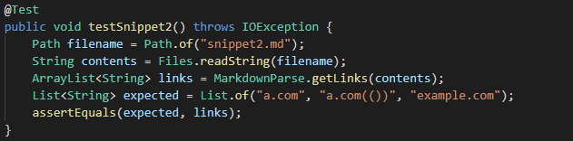
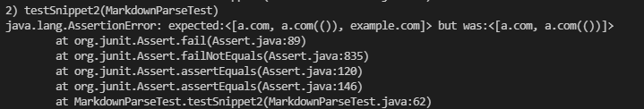
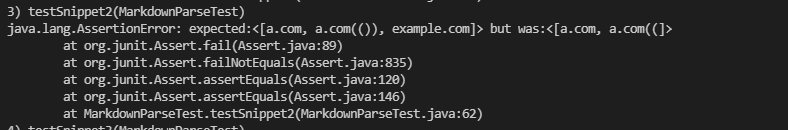
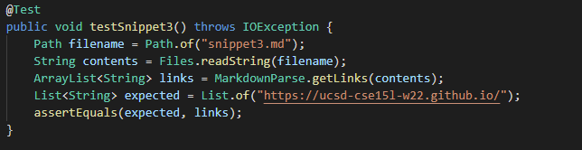
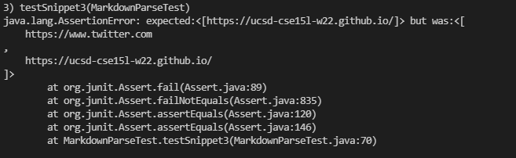
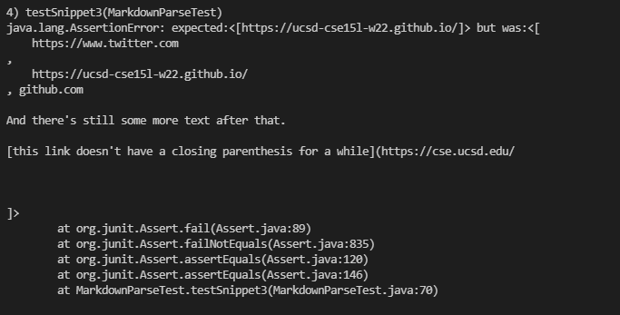

# Lab Report 4

***

Click [here](https://github.com/rajsunku/markdown-parse) for a link to my MarkdownParse repository.

Click [here](https://github.com/alckasoc/markdown-parse) for a link to the repository I reviewed.

## Code Snippet 1

Based on [the CommonMark demo site](https://spec.commonmark.org/dingus/), expected output is: ``["`google.com", "google.com", "ucsd.edu"]``

Here is the code adding the snippet to my test:

Here is the output from my code:

Here is the output from the code I reviewed:

## Code Snippet 2

Based on [the CommonMark demo site](https://spec.commonmark.org/dingus/), expected output is: ``["a.com", "a.com(())", "example.com"]``

Here is the code adding the snippet to my test:

Here is the output from my code:

Here is the output from the code I reviewed:

## Code Snippet 3

Based on [the CommonMark demo site](https://spec.commonmark.org/dingus/), expected output is: ``["https://ucsd-cse15l-w22.github.io/"]``

Here is the code adding the snippet to my test:

Here is the output from my code:

Here is the output from the code I reviewed:

## Changes to my code

Snippet 1: There could be a small change made to the code that fixes this issue. The chnage would be that text stored in between backticks should be skipped unless those backticks are stored in a set of parenthesis or brackets.

Snippet 2: There only needs to be a small change for my code to pass this test. Since I have code for nested parenthesis, I can do something similar for nested brackets, which is why the third link is not showing up.

Snippet 3: To fix the issues with this snippet, it would require a fairly large change to my code. This is because there are many different reasons why my code didn't work. Firstly, it didn't consider that there could be line changes in between a set of parenthesis or brackets, but the difficult part to actually fix is that there can be a single line break between the opening paranthesis and the link, and the link and the closing paranthesis. However, if there is more than one of them, the link should not be added to the list.
