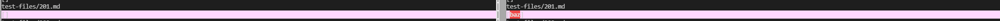
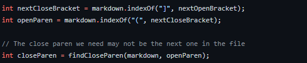
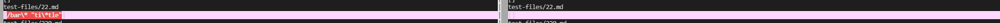
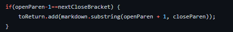

# Lab Report 5

***

To find tests with different outputs between my and the given MarkdownParse programs, I used the `vimdiff` command with both of the outputs. This has the same functionality as the `diff` command, except that it has a more readable UI.

## Test 1

Here are the outputs for `201.md`. On the left side is the output from my implementation, and on the right side is the output from the given implementation. The expected output should be that there are no links, which means that the given implementation is incorrect.

Output:

The issue in the given implementation is that it does not check to see if the opening parenthesis is next to the closing bracket. As shown in the code below, it completely skips this step and skips to finding the close bracket. This should be checked in the empty space before finding the closing parenthesis.

## Test 2

Here are the outputs for `22.md`. On the left side is the output from my implementation, and on the right side is the output from the given implementation. The expected output should be `[/bar*]` since that is what the link goes to based on [the CommonMark demo site](https://spec.commonmark.org/dingus/), meaning that both implementations are incorrect.

Output:

The issue with my implementation is that it simply just adds whatever is in between the parenthesis without parsing the information. For example, a `\*` in the parenthesis actually should parse to a `*`. The backslash in this case is an escape sequence and wouldn't be included in the link. To fix this in my code, I would have to add a method that parses the information in between the parenthesis. I would then call that function on the substring in the snippet below and then add it to the list.

